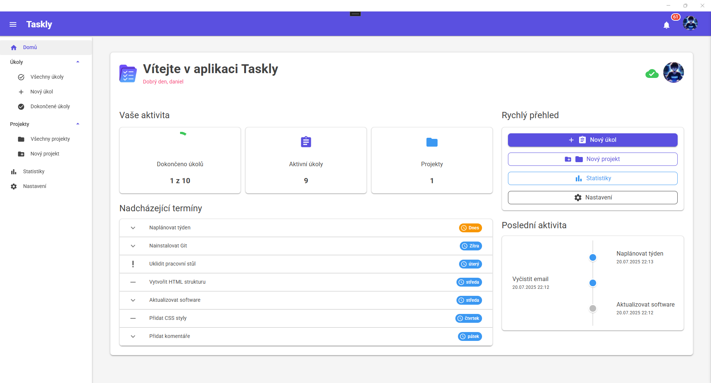

# Taskly

Demonstrační aplikace pro bakalářskou práci - Využití Blazor Hybrid s .NET MAUI pro vývoj nativních aplikací

## O projektu

Taskly je aplikace pro správu úkolů, kterou jsem vytvořil jako praktickou část bakalářské práce na Katedře informatiky PřF UPOL. Cílem bylo demonstrovat možnosti Blazor Hybrid technologie při vývoji multiplatformních aplikací.

Aplikace kombinuje webové komponenty (Blazor) s nativními funkcemi .NET MAUI, což umožňuje sdílet většinu kódu mezi platformami. Implementoval jsem plnou offline podporu s automatickou synchronizací, systémové notifikace a responzivní UI, které funguje na Windows i Androidu.

## Hlavní funkce

### Správa úkolů
- Základní CRUD operace (vytváření, editace, mazání)
- Systém priorit: Nízká, Střední, Vysoká, Kritická
- Stavy úkolů: Nový, Probíhající, Dokončený, Odložený, Zrušený
- Termíny dokončení s automatickými připomínkami
- Přiřazení k projektům
- Filtrování a vyhledávání

### Projekty
- Organizace úkolů do logických celků
- Sledování postupu na úrovni projektu
- Vlastní termíny pro celé projekty
- Statistiky počtu úkolů

### Offline režim
- Plná funkcionalita bez připojení k internetu
- Lokální LiteDB databáze
- Automatická synchronizace při obnovení připojení
- Vizuální indikátor stavu synchronizace

### Notifikace
- In-app notifikace pomocí MudBlazor toastů
- Systémové push notifikace (Android/Windows)
- Nastavitelné připomínky: 30 minut, 2 hodiny, 1 den před termínem
- Historie notifikací

### Uživatelské rozhraní
- Material Design pomocí MudBlazor
- Podpora světlého a tmavého režimu
- Výběr barevného schématu
- Responzivní design
- Nastavitelná hustota UI

## Použité technologie

### Core
- **.NET 8.0** s **C# 12**
- **.NET MAUI** - multiplatformní framework
- **Blazor Hybrid** - webové UI v nativní aplikaci

### UI knihovny
- **MudBlazor 7.15.0** - Material Design komponenty
- **CommunityToolkit.Maui** - rozšíření MAUI

### Backend služby
- **Firebase Firestore** - NoSQL databáze
- **Firebase Authentication** - správa uživatelů
- **Firebase Storage** - ukládání souborů
- **LiteDB 5.0** - lokální embedded databáze

### Další knihovny
- **Plugin.LocalNotification** - systémové notifikace
- **Microsoft.Toolkit.Uwp.Notifications** - Windows toasty
- **Google.Cloud.Firestore** - Firestore SDK

## Screenshoty

### Dashboard


### Správa úkolů


### Nastavení


### Mobilní verze


## Architektura

Aplikace využívá vícevrstvou architekturu:

```
┌─────────────────────────────┐
│   Blazor UI (Razor Pages)   │
├─────────────────────────────┤
│     Services (DI)           │
├─────────────────────────────┤
│   Data Access Layer         │
├──────────┬──────────────────┤
│  LiteDB  │  Firebase        │
└──────────┴──────────────────┘
```

### Hlavní služby
- **AuthService** - autentizace a správa sessions
- **TaskService** - práce s úkoly
- **ProjectService** - správa projektů
- **NotificationService** - systém notifikací
- **ThemeService** - nastavení vzhledu
- **ConnectivityService** - monitoring připojení
- **CacheService** - optimalizace výkonu

## Instalace

### Pro uživatele - Instalace z připravených balíčků

Připravené instalační balíčky najdete ve složce `Instalace/`:

**Android:** `com.danielmanak.taskly-Signed.apk`  
**Windows:** `Taskly_1.0.0.0_x64.msix` (nejdřív nainstalujte certifikát)

Detailní návody najdete ve složce `Instalace/`.

### Pro vývojáře - Build ze zdrojového kódu

#### Požadavky
- Visual Studio 2022 (17.8+)
- .NET 8 SDK
- .NET MAUI workload
- Android SDK (pro Android)
- Windows 10 SDK (pro Windows)

### Kroky instalace

1. **Klonování repozitáře**
```bash
git clone https://github.com/manada02/Taskly.git
cd Taskly
```

2. **Konfigurace Firebase**
   - Vytvořte projekt na Firebase Console
   - Povolte Authentication (Email/Password)
   - Vytvořte Firestore databázi
   - Stáhněte konfigurační soubory
   - Umístěte je do `Firebase_config/`
   - Upravte `appsettings.json` s vašimi Firebase údaji

3. **Spuštění aplikace**
```bash
# Android
dotnet build -t:Run -f net8.0-android

# Windows
dotnet build -t:Run -f net8.0-windows10.0.19041.0
```

## Struktura projektu

```
Taskly/
├── Components/          # Blazor komponenty
│   ├── Core/           # Základní komponenty
│   ├── Projects/       # Projektové komponenty
│   └── Tasks/          # Úkolové komponenty
├── Firebase_config/    # Firebase konfigurace
├── LocalStorage/       # LiteDB konfigurace
├── Models/            # Datové modely
├── Pages/             # Razor stránky
├── Platforms/         # Platform-specific kód
├── Services/          # Business logika
│   ├── Auth/         # Autentizace
│   ├── Cache/        # Cachování
│   ├── Connectivity/ # Monitoring sítě
│   ├── Notification/ # Notifikace
│   ├── Projects/     # Správa projektů
│   ├── Tasks/        # Správa úkolů
│   └── UI/          # UI služby
└── wwwroot/          # Statické soubory
```

## Implementované vzory

- **Service pattern** - oddělení business logiky
- **Dependency Injection** - správa závislostí  
- **Offline-first** - priorita offline funkčnosti

## Výkonnostní optimalizace

- **Dvouúrovňové cachování** - RAM + SecureStorage
- **Inteligentní synchronizace** - pouze změněná data
- **Lazy initialization** - postupná inicializace služeb

## Zajímavé implementační detaily

1. **Multi-device ochrana** - automatické odhlášení při přihlášení na jiném zařízení
2. **Inteligentní synchronizace** - pouze změněná data s příznakem `NeedsSynchronization`
3. **Platform-specific kód** - minimální, pouze pro nativní funkce
4. **Responzivní navigace** - přizpůsobení UI podle velikosti obrazovky

## Známé omezení

- iOS verze není podporována (vyžaduje macOS pro kompilaci)
- Některé pokročilé funkce Firestore nejsou implementovány
- Maximální velikost profilového obrázku je 5 MB

## Akademický kontext

Tato aplikace vznikla jako praktická demonstrace možností Blazor Hybrid technologie. Hlavní cíle byly:

1. Ukázat výhody sdílení kódu mezi platformami (95%+ sdílený kód)
2. Demonstrovat offline-first přístup s cloudovou synchronizací
3. Implementovat moderní UI/UX principy
4. Využít nativní funkce při zachování webového vývoje

## Poděkování

Děkuji komunitě .NET MAUI za skvělou dokumentaci a příklady, které mi pomohly při vývoji aplikace.

---

**Autor**: Daniel Maňák  
**Fakulta**: Přírodovědecká fakulta
**Katedra**: Katedra informatiky   
**Univerzita**: Palackého v Olomouci 
**Rok**: 2025

*Kód je volně k dispozici pro studijní účely. Pro komerční využití mě prosím kontaktujte.*

